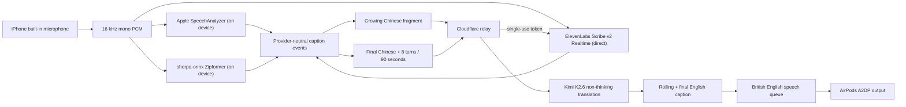

# Mandarin Listener

A personal iOS 26 listening aid for fast, in-person Mandarin. The iPhone microphone captures the nearby speaker, live Chinese captions appear quickly, Kimi streams a rolling English preview while the phrase is still being recognised, and AirPods play the completed translation privately.

The app targets a useful 2–4 second comprehension delay. It does not claim word-for-word simultaneous interpretation.

## Architecture



Apple recognition remains the unverified default. A bundled sherpa-onnx streaming Zipformer provides a second, fully offline Mandarin recognizer. ElevenLabs remains an optional cloud comparison: the phone requests a short-lived token from the relay and sends audio directly to ElevenLabs, so Cloudflare never receives audio.

Wispr Flow is not integrated. Its correction and personal-dictionary methodology is used locally: an explicit caption correction learns only the changed Chinese terms, biases later recognition, and never silently rewrites later transcripts.

## Repository

- `ios/MandarinListener`: SwiftUI app, audio routing, recognition providers, corrections, translation, TTS, and export.
- `ios/MandarinListenerCore`: portable policies and models with local Swift tests.
- `relay`: stateless TypeScript Cloudflare Worker for ElevenLabs token exchange and Kimi translation.
- `benchmarks`: deterministic fixtures, a private 36-clip human benchmark template, translation cases, and evaluator.
- `docs`: physical-device and real-conversation acceptance checks.

## 1. Configure the relay

Prerequisites:

- A Kimi API key at a rate tier suitable for phrase-level translation.
- Optionally, an ElevenLabs API key with Scribe Realtime access.
- A Cloudflare account.

Install dependencies and authenticate:

```sh
cd relay
npm install
npx wrangler login
```

Generate a private 256-bit client token:

```sh
openssl rand -hex 32
```

Store the two required secrets. Paste the generated client token for `CLIENT_AUTH_TOKEN`, then later paste the same value into the iPhone app:

```sh
npx wrangler secret put KIMI_API_KEY
npx wrangler secret put CLIENT_AUTH_TOKEN
npm run deploy
```

Add `ELEVENLABS_API_KEY` only if the optional cloud recognizer will be tested.

The deploy command prints the relay URL. Verify it with:

```sh
curl https://YOUR-WORKER.workers.dev/health
```

The app’s Settings check additionally calls authenticated `GET /v1/auth/check` to verify the client token and relay identity without consuming a provider request.

The checked-in Worker configuration rate-limits the one personal client to 200 translations and 20 ElevenLabs session tokens per minute. Keep provider-side credit/spend caps enabled as a second boundary, and rotate `CLIENT_AUTH_TOKEN` if the phone or token is compromised.

For local relay work, copy `relay/.dev.vars.example` to `relay/.dev.vars`. The destination file is ignored by Git.

## 2. Build the iPhone app

For a new Mac, the shortest supported setup is:

```sh
gh repo clone Jasonada13/mandarin-listener
cd mandarin-listener
make bootstrap
make open-project
```

Install full Xcode, Node.js, and XcodeGen first. The bootstrap installs pinned relay
packages, downloads checksum-verified speech dependencies, regenerates the Xcode
project, and runs all checks. See [Second Mac and travel handoff](docs/SECOND_MAC_SETUP.md)
for signing, the weekly Personal Team refresh, and secure relay-token transfer.

For an existing checkout, fetch the checksum-verified speech runtime and model directly with:

```sh
./scripts/fetch-sherpa-onnx-ios.sh
```

This machine runs macOS Sequoia 15.7.7 with Xcode 26.3 and the iOS 26.2 platform installed. The project is configured for the Personal Team, and a signed physical-device build has been installed successfully. To open the project:

```sh
cd ios
xcodegen generate
open MandarinListener.xcodeproj
```

For later builds in Xcode:

1. Select the `MandarinListener` target.
2. Confirm the Personal Team remains selected under Signing & Capabilities.
3. Connect your iPhone, select it as the run destination, and build and run.
4. On first use, trust the Personal Team developer profile if iOS requests it.
5. Enter the deployed relay URL and client token in Settings.
6. Start with Apple recognition, then replay the same phrases through Sherpa. Configure ElevenLabs only if a cloud comparison is still useful.

If `com.jasonadams.MandarinListener` is unavailable to your signing team, change the bundle identifier to another unique reverse-domain value.

## Runtime behaviour

- The audio session uses `.playAndRecord` with `.allowBluetoothA2DP`.
- Bluetooth HFP input is deliberately excluded; the app explicitly requests the built-in iPhone microphone.
- Apple prefers `SpeechTranscriber` and internally falls back to `DictationTranscriber` where necessary.
- Sherpa uses the Apache-2.0 sherpa-onnx runtime with a 2025 streaming Mandarin Zipformer model, modified beam search, 0.8-second endpoint silence, and local hotwords.
- ElevenLabs uses `scribe_v2_realtime`, Mandarin `zho`, 16 kHz PCM, 100 ms chunks, and server VAD.
- Recognition fallback is loop-safe: ElevenLabs prefers Apple then Sherpa; either on-device recognizer can try the other before optional ElevenLabs.
- Kimi streams a best-effort rolling preview from partial text. Once recognition finalises, the structured final translation remains authoritative and silently corrects the preview if necessary.
- Preview requests are back-pressured to one in flight plus the newest pending fragment, rather than translating individual words independently. This avoids stale request buildup and reduces misleading Mandarin word-order errors.
- If the final Chinese matches a completed preview, the cached English can be shown and spoken immediately while the authoritative final translation is checked in the background.
- The app automatically selects the best installed non-novelty British-English voice (Premium, then Enhanced, then Compact), with a manual voice picker in Settings.
- If Kimi or the relay is unavailable, Chinese captions continue and English is marked unavailable.
- If AirPods disconnect, TTS stops immediately while captions continue.
- A call or Siri interruption pauses the session and requires an explicit Resume.
- Background audio supports a locked-screen session, but the phone microphone must remain exposed.
- Spoken backlog is bounded to five seconds; captions are never discarded.

## Corrections and vocabulary

Each finalized Chinese card can be corrected. Saving:

- cancels its stale translation and unstarted speech;
- retranslates the corrected phrase with corrected recent context;
- rejects any late response from an older revision;
- stops speech already playing for that card and leaves the new result for Replay;
- learns only newly introduced Chinese tokens.

Vocabulary is capped at 100 ranked terms. Apple receives up to 100 terms immediately; Sherpa applies up to 100 hotwords at an utterance boundary; ElevenLabs receives the top 50 on its next connection. The vocabulary file is protected, excluded from device backups, and never synced. Transcripts remain in memory; explicit export creates a temporary UTF-8 Markdown file and removes it after sharing. Audio is never retained by the app or relay.

## Verification

Run all local checks:

```sh
make check
```

Generate deterministic synthetic Mandarin WAV fixtures:

```sh
make benchmark-audio
```

The synthetic clips are regression fixtures, not evidence of real-world quality. Populate `benchmarks/private/` from the 36-slot human template, replay identical 100 ms frames through both recognizers three times, and evaluate:

```sh
node benchmarks/evaluate-asr.mjs \
  --manifest benchmarks/private/human-manifest.json \
  benchmarks/private/human-apple-results.json \
  benchmarks/private/human-elevenlabs-results.json
```

Keep Apple as default unless ElevenLabs clears every gate documented in `benchmarks/README.md`. Complete `docs/DEVICE_TEST_CHECKLIST.md` before relying on the app in conversation, then record the three-session MVP result in `docs/ACCEPTANCE_LOG.md`.

See `docs/IMPLEMENTATION_STATUS.md` for the exact boundary between completed software checks and the remaining account/device/private-data gates.

## Privacy boundary

- Apple can recognize speech on-device after its Simplified Chinese asset is installed.
- Sherpa recognizes locally from the bundled model and does not require a speech service or network.
- ElevenLabs receives microphone audio directly and remains subject to its account retention terms.
- Kimi receives the current Mandarin fragment or final Mandarin plus recent text context.
- The relay logs request IDs, provider status, latency, token counts, and error codes only.
- No audio, transcript text, provider body, token, key, or authorization header is logged or stored by this repository.
